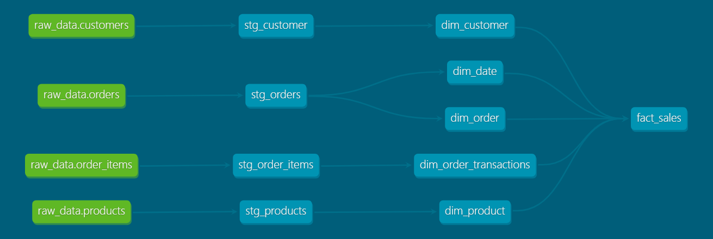
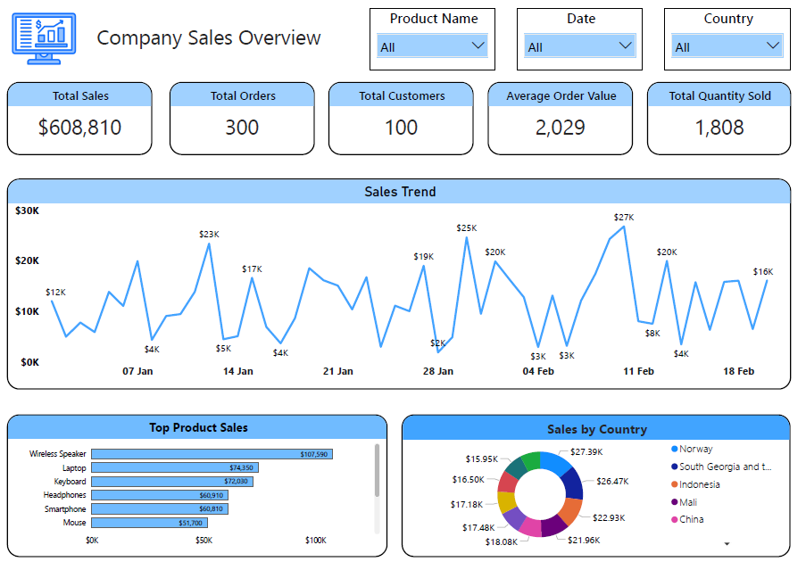

# ❄️ Snowflake Data Pipeline with dbt, Airflow, and Power BI

This project is part of my **Elevvo Pathways Internship Program**, where I built a complete **data pipeline** — from data extraction and transformation to visualization.

---

## 🚀 Project Overview

The goal of this project is to design a **modern data pipeline** that automates the process of loading, transforming, and visualizing sales data.

The pipeline flow is as follows:

**Snowflake (Database)** ➜ **dbt (Transform & Model)** ➜ **Airflow (Orchestration)** ➜ **Power BI (Dashboard)**

---

## 🧩 Architecture

---

## 🗄️ Data Model

The data warehouse contains **one fact table** and **four dimension tables**:

| Table Type | Table Name | Description |
|-------------|-------------|--------------|
| Fact | `fact_sales` | Contains transaction-level sales data |
| Dimension | `dim_date` | Includes date attributes like day, month, and year |
| Dimension | `dim_customer` | Stores customer-related information |
| Dimension | `dim_product` | Contains product details |
| Dimension | `dim_order` | Holds order-level data |

---

## ⚙️ Tools and Technologies

| Tool | Purpose |
|------|----------|
| **Snowflake** | Cloud data warehouse for storing raw and transformed data |
| **dbt (Data Build Tool)** | Data transformation, testing, and modeling |
| **Apache Airflow** | Automates and schedules dbt runs |
| **Power BI** | Builds interactive dashboards for sales insights |
| **SQL** | Core for transformations and analysis |

---

## 📊 Dashboard

The final dashboard provides a complete overview of company sales performance.  

Key insights include:
- **Total Sales, Orders, and Customers**
- **Average Order Value**
- **Sales Trend Over Time**
- **Top Product Sales**
- **Sales Distribution by Country**

---

## 🧠 Key Learnings

- Building and orchestrating pipelines with **dbt** and **Airflow**
- Managing and transforming data in **Snowflake**
- Designing a dimensional model for analytics
- Building clean and interactive dashboards in **Power BI**

---

## 🙏 Acknowledgments

A huge thank you to **[Ansam Yousry](https://www.linkedin.com/in/ansam-yousry/)** for the guidance and support in exploring **Snowflake** throughout this project.  
And special thanks to **Elevvo Pathways** for this amazing learning opportunity.

---

## 🔗 Project Repository

Check out the full project here:  
[👉 GitHub Repository](https://github.com/Ibrahim-Ayman/Snowflake-Data-Pipeline)

---

## 📚 Author

**Ibrahim Ayman**  
Student at Faculty of Electronic Engineering, Menoufia University  

